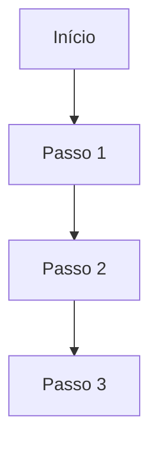

# Template de Adaptador de Domínio

## Setor: [nome do setor]

### Aplica-se quando
[Uma frase: quando usar este adaptador]

### Não se aplica quando
[Uma frase: o que cai no padrão de codificação ou em outro adaptador]

### Evidência
O que conta como evidência neste domínio. Ordem de autoridade:
1. [Fonte mais forte]
2. [Fonte secundária]
3. [Fonte terciária]

### Conjunto mínimo de evidências (vinculante)
Itens que DEVEM ser abertos/consultados antes de agir, toda vez:
- [Item 1]
- [Item 2]
- [Item 3]

### Verificação por observação
O que "verificado" significa neste domínio:
- [Critério 1]
- [Critério 2]

### Tabela de fraudes (para fable-judge)
| Fraude | O que parece | O que realmente é |
|---|---|---|
| [Nome] | [descrição] | [detecção] |
| [Nome] | [descrição] | [detecção] |

### Workflow
1. [Passo 1]
2. [Passo 2]
3. [Passo 3]

### Sources
- [Link ou referência para cada afirmação]
